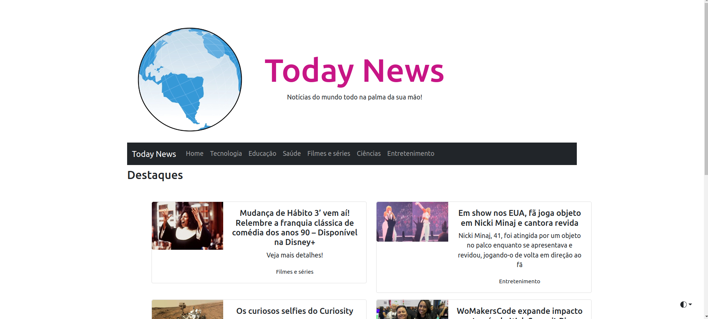
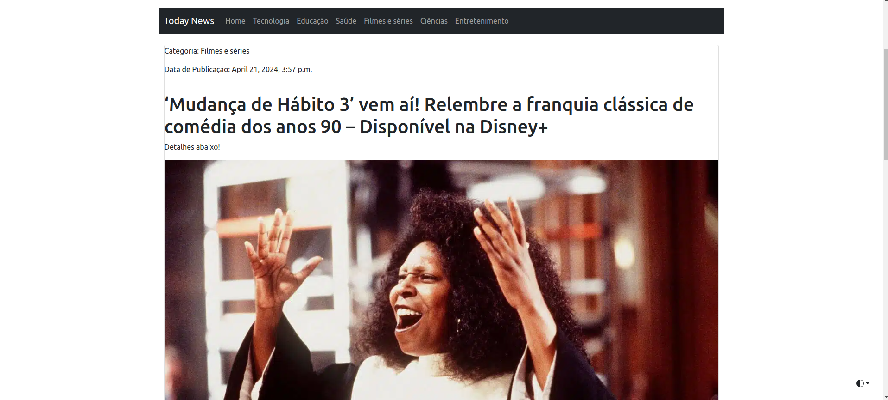
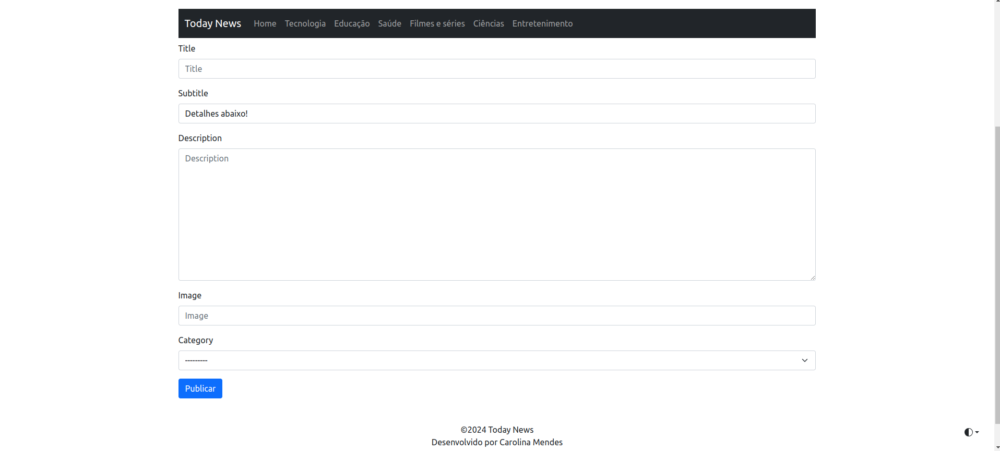
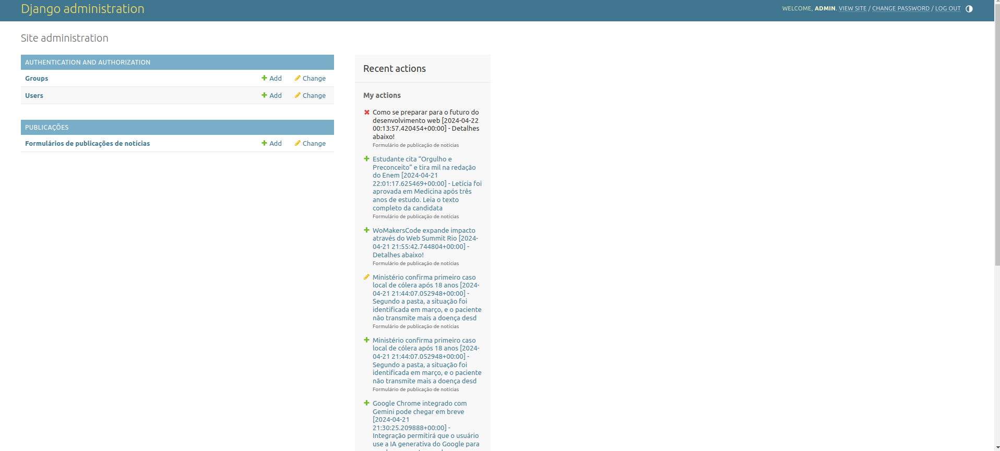

# today-news
Projeto final do bootcamp Backend Python e Django, da WoMakersCode
Site de notícias.

### Tecnologias utilizadas
- Python 3
- Django
- Django Rest Framework
- Bootstrap 5

### Layout
1. Página inicial

2. Detalhe de notícia

3. Formulário de publicação de notícia

4. Página do administrador

### Autora
#### Carolina Mendes - Desenvolvedora Web

